# Subnautica 2 Project

A template Unreal Engine editor project for creating SN2 content mods. 

## If you are brand new to modding

Please get familiar with the basics of modding with this excellent set of guides:

https://github.com/Dmgvol/UE_Modding/

Also start with a basic mod idea, such as changing a property on a blueprint.

## Tools

Get started with [basic mod tooling](./Docs/Tools.md) as outlined in the above UE Modding guides.

## Prerequisites

You need to own Subnautica 2 and have the game installed.

The disk space that will be used - including custom engine and any intermediate folders created while using the project - is **60GB**. 

If you haven't done so already, [follow these instructions on linking your Epic Games and GitHub accounts](https://www.epicgames.com/help/en-US/c-Category_EpicAccount/c-ConnectedAccounts/how-do-i-link-my-unreal-engine-account-with-my-github-account-a000084938?sessionInvalidated=true). If you don't do this, the below custom engine link will return a 404 not found.

You need to install a [custom build of Unreal Engine 5.6](https://github.com/Buckminsterfullerene02/UnrealEngine/releases) (don't worry, you don't need to build or compile anything!). This build is approximately 10GB smaller than the vanilla build from Epic Games Store and is necessary to enable:
- Adding custom materials into the game (this is still WIP unfortunately)
- Working with and being able to open, reference, and use all game content in the project

It is best to install the engine:
- Closer to the root of the drive (if file paths get too long, things break)
- On a file path containing no spaces (some issues occur from not quoting paths correctly)
- Onto an SSD or NVMe

You also need to install Visual Studio 2022 and select the MSVC `v14.38` toolchain to be able to open the project.
- [Helpful guide](https://dev.epicgames.com/documentation/unreal-engine/setting-up-visual-studio-development-environment-for-cplusplus-projects-in-unreal-engine?application_version=5.6)
- [Reddit post in case you get stuck](https://www.reddit.com/r/unrealengine/comments/1i0bopv/detected_compiler_newer_than_visual_studio_2022/)

<details>
<summary><span style="font-size: 1.5em">Setting up and opening the project</span><hr></summary>

1. [Clone](https://docs.github.com/en/desktop/contributing-and-collaborating-using-github-desktop/adding-and-cloning-repositories/cloning-and-forking-repositories-from-github-desktop) or fork this repository. You may choose to download as `.zip`, but it will be much harder to get updates to the project if you do not clone it using `git` directly.

2. Open `GameInstallDirectory.txt` and paste in the location of your game install files like the example path. This should be the folder containing the `Subnautica2.exe` file.

3. Download FMOD for Unreal from https://www.fmod.com/download (you have to sign up first). The plugin cannot be distributed in the project as the FMOD `.dll` files are copyrighted and require an FMOD account to aquire.


4. Run this command in powershell to copy banks and extract FMOD DLLs 
```ps1
powershell -ExecutionPolicy Bypass -File setup-fmod.ps1 -FMODPluginZip "<your downloads>\fmodstudio20309ue5.6win64.zip"
``` 

5. Now right click on `Subnautica2.uproject`, select **Switch Unreal Engine version**, then select to the folder containing the `Engine` folder from the custom engine.


For example mine is here (obviously pick the path where you installed the engine to):


6. Open `Subnautica2.uproject`. It may spend some time compiling some plugins first (2-10 mins depending on your hardware).

</details>

<details>
<summary><span style="font-size: 1.5em">Getting game content into the project</span><hr></summary>

The custom engine is configured to mount the cooked game content directly from your game install files.

All you need to do, is open `GameInstallDirectory.txt` and paste in the location of your game install files like the example path. 

Now when you open the editor, the game content should all be visible!

> [!NOTE]
> Content in the editor is read-only, meaning that even if it allows you to edit the asset, the package cannot be saved and the value will be lost the next time you open the editor. Later on, I will show you how to create uncooked copies of some assets which you can use in your mods.

</details>

<details>
<summary><span style="font-size: 1.5em">Navigating the project</span><hr></summary>

Once the project is open and you can see all the content, there are some additional tips you need to know to use it properly (aside from common UE editor actions):
- When opening levels, you can search for `BP_Ocean` in the details panel and click the eye icon to hide it, so everything is not blurry
- When opening blueprints and widgets, you will just see a properties view. To see more info about the asset:
    - Right click on blueprints and click "Make Uncooked Bluepriny Copy", this then allows you to see the component tree, variables, functions and event stubs
    - Right click on widgets and click "Make Uncooked Widget Copy", this makes a copy of the cooked widget into an uncooked one with the full widget tree and animations
    - Right click on FMOD events and click "Play" or "Stop" to play or stop the audio
- You can directly ctrl+c ctrl+v cooked data assets (and other simple asset types) into your mods. This is especially useful for making new items (see the section below on adding custom items for more info) by copying off of game data assets.

</details>

<details>
<summary><span style="font-size: 1.5em">Making your first blueprint mod</span><hr></summary>

A blueprint mod is used to add in your own logic, modifying other game contents at runtime, adding new fish, fuana, maps, etc. From this "entry point", the mod needs to be loaded in using an external/third-party mod loader, such as UE4SS or a standalone BP mod loader.

Follow the guide on setting up a simple blueprint mod with UE4SS: https://docs.ue4ss.com/dev/feature-overview/blueprint-modloader.html

So, you should have a blueprint actor called `ModActor` in `Content/Mods/<yourmodname>/`.

This project contains `DemoMod` to start with which you can use to follow along with this guide and check that everything is setup correctly. You should see this when you enter the in-game main menu after packaging:


</details>

<details>
<summary><span style="font-size: 1.5em">Packaging the mod (manual)</span><hr></summary>

In this project, we use pak chunks to package your mod files into `.pak` + `.ucas` + `.utoc` mods.

In your mod folder, right click and select **Miscellaneous > Data Asset**:


Now search for and select `Primary Asset Label`.


To follow standard UE naming conventions, call it `PAL_yourmodname` e.g. `PAL_DemoMod`.


Open the asset, set `Cook Rule` to `Always Cook`, and check `Label Assets in My Directory`, like so.


Enter a number between `1` and `300` in this chunk Id field and press Ok. **Do not enter 0 for the Id!**

> [!IMPORTANT]
> Each mod **must** use a seperate pak chunk number to get packaged seperately from each other! Take note of each pak chunk Id you are assigning to files in each mod.


This PAL is a good pal, because it will automatically assign all files in your mod folder with the chunk Id you set for it. It does not get packaged into the game (unless you explicitly tell it to), as it's just a tool for the editor.

Now do `Ctrl` + `S` to save.

Simply click on to `Platforms` -> `Windows` -> `Package Project`:


Now select the output folder location. It doesn't matter much where you put it, so I always just put it into the template project folder. It will create a `Windows` folder. You don't need to delete this folder between packages.

The first time you package it might take a while, as it will likely need to compile some shaders.

Once it is done, you will hear a noise and it will say Packaging complete.

Now navigate to the `Windows/Subnautica2/Content/Paks` folder, you should see all pakchunk files here. There will always be a `pakchunk0` which contains all other packaged editor assets, and it is quite large, so this is why you mustn't set your chunkId to 0.


</details>

<details>
<summary><span style="font-size: 1.5em">Installing the packaged mod</span><hr></summary>

First copy the pakchunk id files, for the number you entered for your mod files. E.g. you set your id to 14, so copy `pakchunk14-Windows.pak`, `pakchunk14-Windows.utoc` & `pakchunk14-Windows.ucas`. 

Navigate to `<steam install>\Subnautica2\Subnautica2\Content\Paks\LogicMods\` and create a folder for your mod (if `LogicMods` folder is not there yet, make it). It should have the same name as the mod folder in the unreal engine project.

Now paste your pakchunk files into the mod folder.

Rename the pakchunk files to the same name as the mod folder in the project, keeping their extensions.

> [!IMPORTANT]
> The files must be the same name as the mod folder in the unreal engine project! If you change the mod folder name in the project later, make sure the update the file names to match it! E.g. if the mod folder in the project is `MyMod`, the files must be called `MyMod.pak`, `MyMod.ucas`, `MyMod.utoc`.

</details>

<details>
<summary><span style="font-size: 1.5em">Automation: SN2 Mod Tools</span><hr></summary>

The above steps are too manual to repeat over and over, but I explained them first so that you understand what the automation is actually doing (in case something breaks and you need to look at why).

So this is where the SN2 Mod Tools plugin, primary developed by `bmartin127`, comes in to help reduce the load.

In the editor, in the play in editor toolbar, you will notice the button for Mod Tools:


First open `Plugin settings...` and check that the game directory install path is correct, or change it if it isn't.

If you want to make a new mod with the `ModActor` and `PAL` settings, click `New mod...` and type in mod name, and it will create the mod folder, the assets, and assign an unused chunkid to it.

Then to cook the project and install a mod, right click on the mod folder and select `Cook & Install`. 


If you have multiple mods that you want to install after a single cook, you may also click on `Install` and that will install that mod's packaged files without having to recook again. And to uninstall the mod, just `Uninstall` button.

Finally, you can quickly launch SN2 by clicking the Mod Tools button and clicking `Launch Subnautica 2`. **Note:** it only works when the game is installed through steam.

</details>

<details>
<summary><span style="font-size: 1.5em">Creating new items, recipes, biomods, scannables, buildings, databank entries or story goals</span><hr></summary>

Subnautica 2 uses data assets to define various gameplay content which are scanned in when the game is loaded - there is NO hardcoding and NO hacky workarounds required to "hook" into this system! The following content can be added into the game using only this project:
- Items (tools, intermediates, food, upgrades etc - stuff that goes in your inventory)
- Crafting recipes
- Crafting recipe categories
- Biomods
- Scannables (objects that you scan in the world to unlock anything that depends on them)
- Buildings (that show up in your build menu)
- Building categories
- Databank entries
- Story goals

This is achieved by creating a content-only DLC plugin and adding our content into there. We will then package the plugin mod and install it to a location in the game that the engine will load without any external/third party mod loader required!

First, navigate to the Plugins menu:

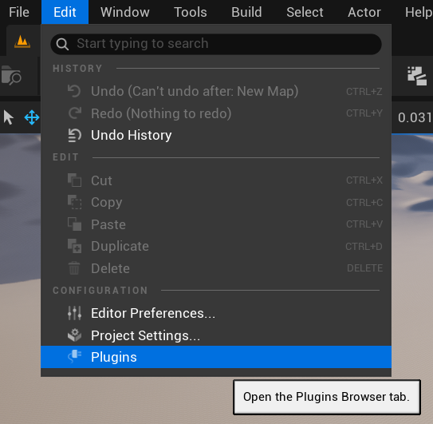

Now click "Add plugin":

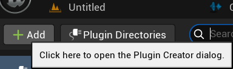

Click "Content-only plugin" and enter your mod name, author, description etc. details. **Do not change the project path!**

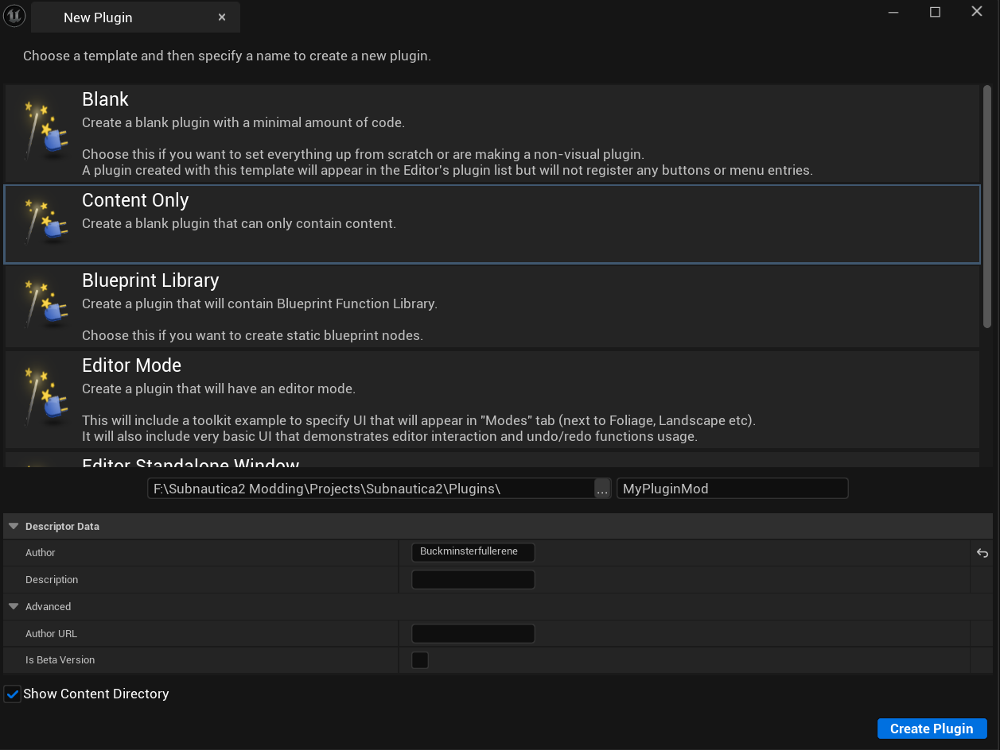

The rest of the guide is a bit of a doozy to write up and I don't have the time. So, for now, you can refer to the `TestPluginMod` for examples.

Packaging the mod is slightly different than with SN2 Mod Tools. First, click on the Alpakit button in the toolbar:

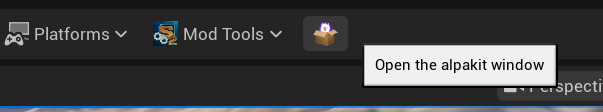

It will open a window with a list of plugins:

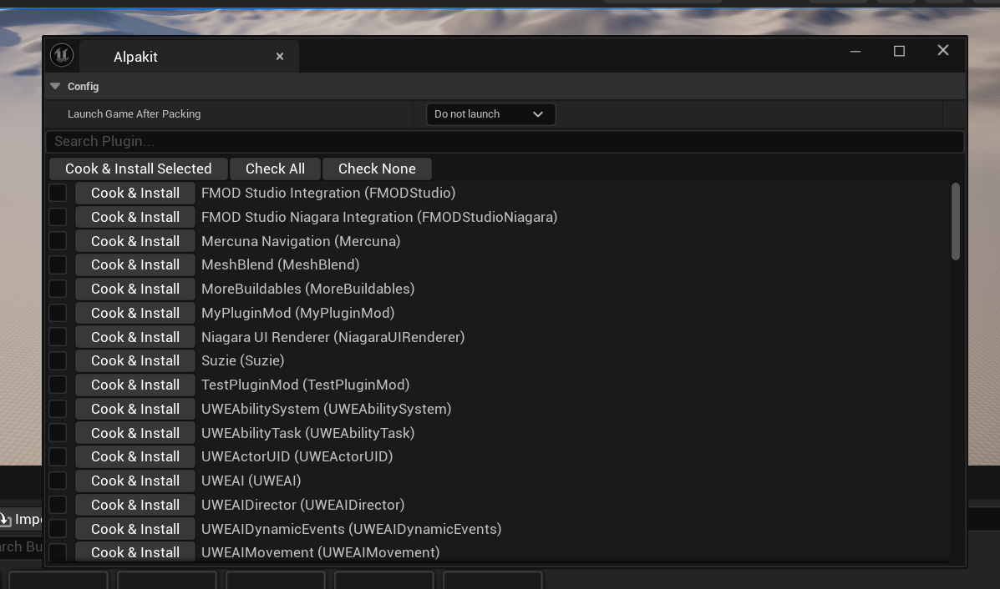

I always have this window docked to the side so it can be clicked on quickly:

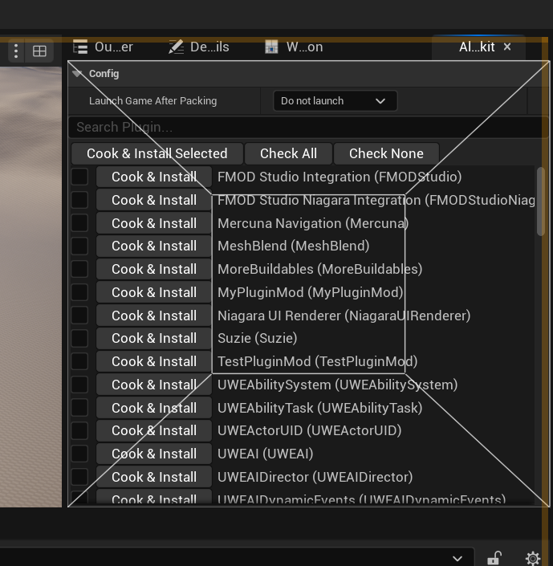

Then simply find your mod plugin and click "Cook & Install". If you want to do multiple at once, use the checkboxes to select multiple and then click "Cook & Install" at the top.

Your mod will be installed to the `<game install dir>/Subnautica 2/Mods/` directory. 

And that's it! When you launch the game, your data is automatically scanned and registered into the game. Here is what it should look like from the TestPluginMod:

<details>
<summary><span style="font-size: 1em"><b>Demo screenshots</b></span><hr></summary>

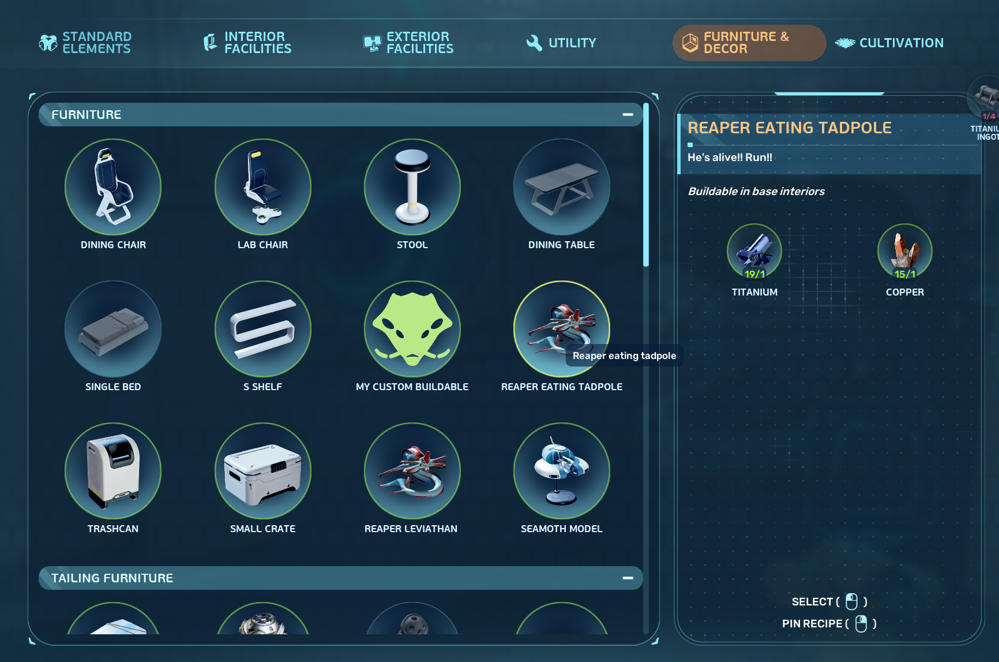

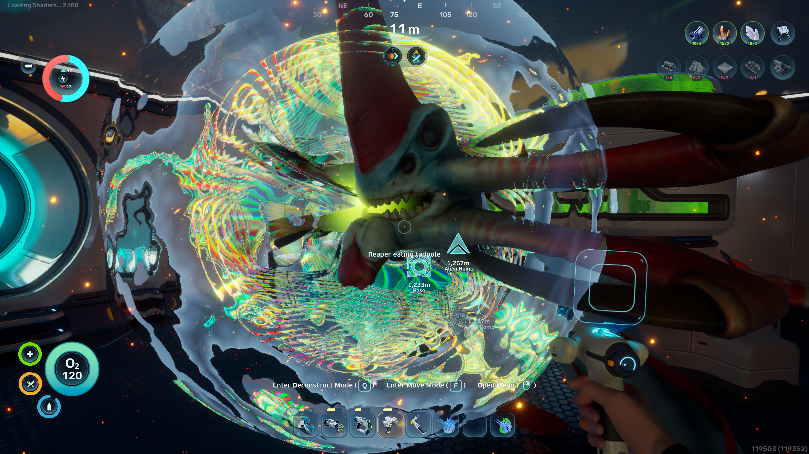

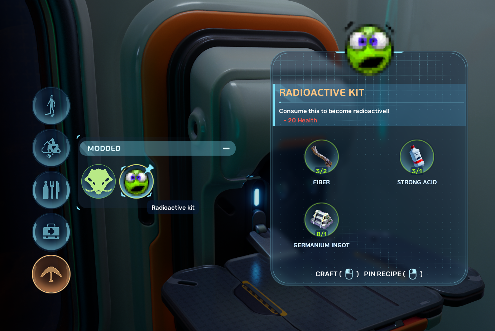

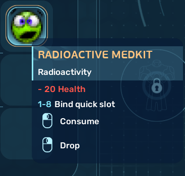

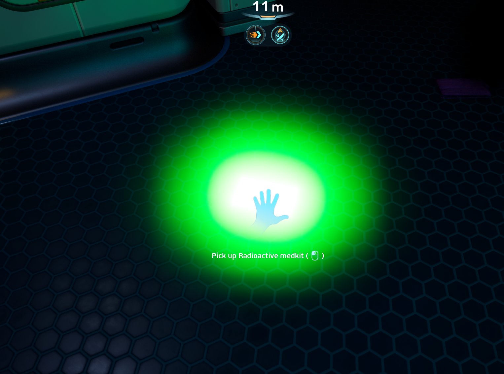

</details>

I also released a commentary video of me adding a new RGB disco light. It's 1 hour long and in the middle I'm mostly trying to figure out why it's not working - but the first 20 mins and last 20 mins are the most useful parts!

<iframe width="560" height="315" src="https://www.youtube.com/embed/50UhTEQ8NwU?si=1am3SGPe60JO5Jp0" title="YouTube video player" frameborder="0" allow="accelerometer; autoplay; clipboard-write; encrypted-media; gyroscope; picture-in-picture; web-share" referrerpolicy="strict-origin-when-cross-origin" allowfullscreen></iframe>

</details>

## Credits to:

- anonymous crazy gigachad for reversing and implementing the game's engine shader changes, allowing for custom materials to work without crashing the game
- axolotl/bmartin for developing the initial version of SN2 Mod Tools plugin
- paboyafx for figuring out the final fix required to get custom items working
- Archengius & truman for making the goated jmap and Suzie tools

### Please return the favour!

Speaking of credits... if you release a mod using this project, I only ask that you add a credit to the project in your mod description - something like

> Created using the Unofficial Subnautica 2 modkit https://github.com/Subnautica2Modding/Subnautica2-Project/

## Thanks and happy modding!

- Buckminsterfullerene