# Subnautica 2 Project

A template Unreal Engine editor project for creating SN2 content mods. 

## If you are brand new to modding

Please get familiar with the basics of modding with this excellent set of guides:

https://github.com/Dmgvol/UE_Modding/

Also start with a basic mod idea, such as changing a property on a blueprint.

## Tools

Get started with [basic mod tooling](./Docs/Tools.md) as outlined in the above UE Modding guides.

## Prerequisites

You need to own Subnautica 2 and have the game installed.

The disk space that will be used - including custom engine and any intermediate folders created while using the project - is **60GB**. 

If you haven't done so already, [follow these instructions on linking your Epic Games and GitHub accounts](https://www.epicgames.com/help/en-US/c-Category_EpicAccount/c-ConnectedAccounts/how-do-i-link-my-unreal-engine-account-with-my-github-account-a000084938?sessionInvalidated=true). If you don't do this, the below custom engine link will return a 404 not found.

You need to install a [custom build of Unreal Engine 5.6](https://github.com/Buckminsterfullerene02/UnrealEngine/releases) (don't worry, you don't need to build or compile anything!). This build is approximately 10GB smaller than the vanilla build from Epic Games Store and is necessary to enable:
- Adding custom materials into the game (this is still WIP unfortunately)
- Working with and being able to open, reference, and use all game content in the project

It is best to install the engine:
- Closer to the root of the drive (if file paths get too long, things break)
- On a file path containing no spaces (some issues occur from not quoting paths correctly)
- Onto an SSD or NVMe

You also need to install Visual Studio 2022 and select the MSVC `v14.38` toolchain to be able to open the project.
- [Helpful guide](https://dev.epicgames.com/documentation/unreal-engine/setting-up-visual-studio-development-environment-for-cplusplus-projects-in-unreal-engine?application_version=5.6)
- [Reddit post in case you get stuck](https://www.reddit.com/r/unrealengine/comments/1i0bopv/detected_compiler_newer_than_visual_studio_2022/)

## Setting up and opening the project

1. [Clone](https://docs.github.com/en/desktop/contributing-and-collaborating-using-github-desktop/adding-and-cloning-repositories/cloning-and-forking-repositories-from-github-desktop) or fork this repository. You may choose to download as `.zip`, but it will be much harder to get updates to the project if you do not clone it using `git` directly.

2. Open `GameInstallDirectory.txt` and paste in the location of your game install files like the example path. This should be the folder containing the `Subnautica2.exe` file.

3. Download FMOD for Unreal from https://www.fmod.com/download (you have to sign up first). The plugin cannot be distributed in the project as the FMOD `.dll` files are copyrighted and require an FMOD account to aquire.

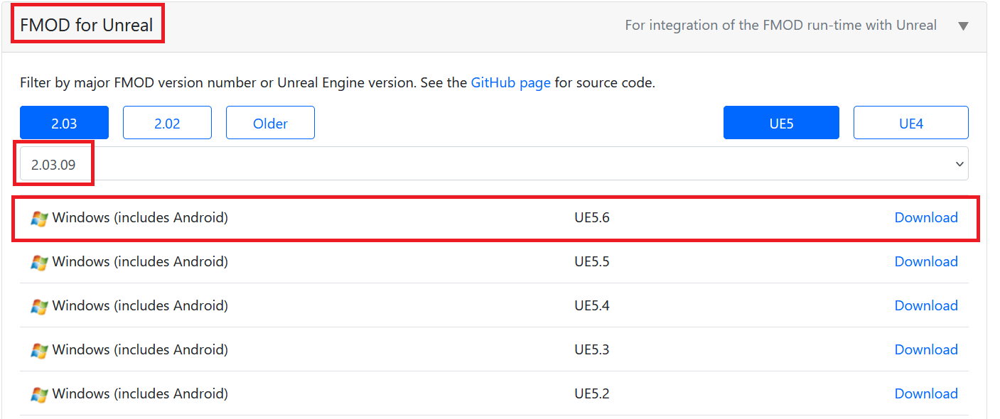

4. Run this command in powershell to copy banks and extract FMOD DLLs 
```ps1
powershell -ExecutionPolicy Bypass -File setup-fmod.ps1 -FMODPluginZip "<your downloads>\fmodstudio20309ue5.6win64.zip"
``` 

5. Now right click on `Subnautica2.uproject`, select **Switch Unreal Engine version**, then select to the folder containing the `Engine` folder from the custom engine.

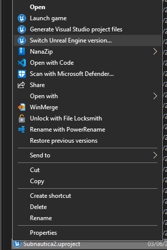

For example mine is here (obviously pick the path where you installed the engine to):

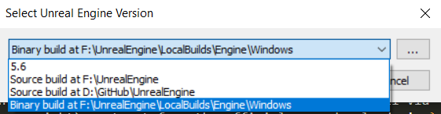

6. Open `Subnautica2.uproject`. It may spend some time compiling some plugins first (2-10 mins depending on your hardware).

## Getting game content into the project

The custom engine is configured to mount the cooked game content directly from your game install files.

All you need to do, is open `GameInstallDirectory.txt` and paste in the location of your game install files like the example path. 

Now when you open the editor, the game content should all be visible!

> [!NOTE]
> Content in the editor is read-only, meaning that even if it allows you to edit the asset, the package cannot be saved and the value will be lost the next time you open the editor. Later on, I will show you how to create uncooked copies of some assets which you can use in your mods.

## Navigating the project

Once the project is open and you can see all the content, there are some additional tips you need to know to use it properly (aside from common UE editor actions):
- When opening levels, you need to search for `BP_Ocean` in the details panel and click the eye icon to hide it, so everything is no longer black
- When opening blueprints and widgets, you will just see a properties view. To see more info about the asset:
    - Right click on blueprints and click "Create Child Blueprint Class", this then allows you to open the child to see the component tree
    - Right click on widgets and click "Make Uncooked Widget Copy", this makes a copy of the cooked widget into an uncooked one with the full widget tree and animations
    - Right click on FMOD events and click "Play" or "Stop" to play or stop the audio

## Making your first mod

Follow the guide on setting up a simple blueprint mod with UE4SS: https://docs.ue4ss.com/dev/feature-overview/blueprint-modloader.html

So, you should have a blueprint actor called `ModActor` in `Content/Mods/<yourmodname>/`.

This project contains `DemoMod` to start with which you can use to follow along with this guide and check that everything is setup correctly. You should see this when you enter the in-game main menu after packaging:

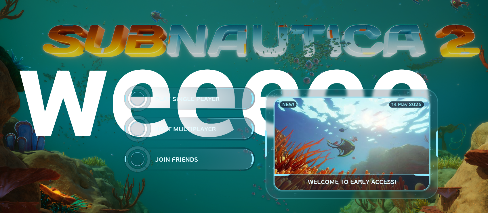

## Packaging your mod

In this project, we use pak chunks to package your mod files into `.pak` + `.ucas` + `.utoc` mods.

In your mod folder, right click and select **Miscellaneous > Data Asset**:

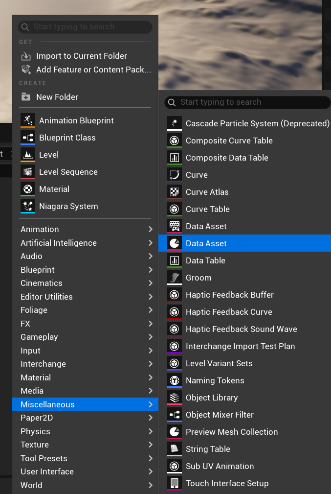

Now search for and select `Primary Asset Label`.

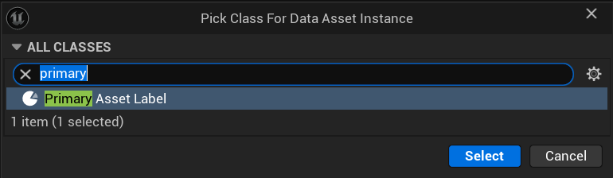

To follow standard UE naming conventions, call it `PAL_yourmodname` e.g. `PAL_DemoMod`.

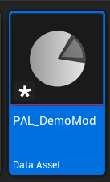

Open the asset, set `Cook Rule` to `Always Cook`, and check `Label Assets in My Directory`, like so.

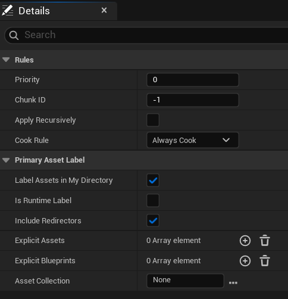

Enter a number between `1` and `300` in this chunk Id field and press Ok. **Do not enter 0 for the Id!**

> [!IMPORTANT]
> Each mod **must** use a seperate pak chunk number to get packaged seperately from each other! Take note of each pak chunk Id you are assigning to files in each mod.

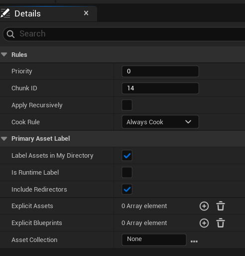

This PAL is a good pal, because it will automatically assign all files in your mod folder with the chunk Id you set for it. It does not get packaged into the game (unless you explicitly tell it to), as it's just a tool for the editor.

Now do `Ctrl` + `S` to save.

Simply click on to `Platforms` -> `Windows` -> `Package Project`:

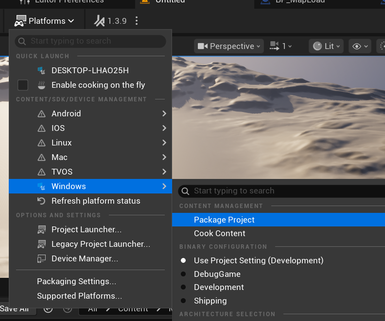

Now select the output folder location. It doesn't matter much where you put it, so I always just put it into the template project folder. It will create a `Windows` folder. You don't need to delete this folder between packages.

The first time you package it might take a while, as it will likely need to compile some shaders.

Once it is done, you will hear a noise and it will say Packaging complete.

Now navigate to the `Windows/Subnautica2/Content/Paks` folder, you should see all pakchunk files here. There will always be a `pakchunk0` which contains all other packaged editor assets, and it is quite large, so this is why you mustn't set your chunkId to 0.

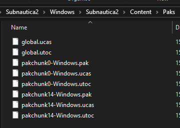

## Installing the packaged mod

First copy the pakchunk id files, for the number you entered for your mod files. E.g. you set your id to 14, so copy `pakchunk14-Windows.pak`, `pakchunk14-Windows.utoc` & `pakchunk14-Windows.ucas`. 

Navigate to `<steam install>\Subnautica2\Subnautica2\Content\Paks\LogicMods\` and create a folder for your mod (if `LogicMods` folder is not there yet, make it). It should have the same name as the mod folder in the unreal engine project.

Now paste your pakchunk files into the mod folder.

Rename the pakchunk files to the same name as the mod folder in the project, keeping their extensions.

> [!IMPORTANT]
> The files must be the same name as the mod folder in the unreal engine project! If you change the mod folder name in the project later, make sure the update the file names to match it! E.g. if the mod folder in the project is `MyMod`, the files must be called `MyMod.pak`, `MyMod.ucas`, `MyMod.utoc`.

## Automating the above: SN2 Mod Tools

The above steps are too manual to repeat over and over, but I explained them first so that you understand what the automation is actually doing (in case something breaks and you need to look at why).

So this is where the SN2 Mod Tools plugin, primary developed by `bmartin127`, comes in to help reduce the load.

In the editor, in the play in editor toolbar, you will notice the button for Mod Tools:

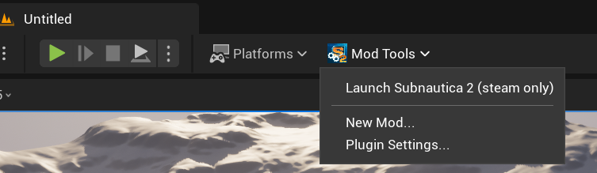

First open `Plugin settings...` and check that the game directory install path is correct, or change it if it isn't.

If you want to make a new mod with the `ModActor` and `PAL` settings, click `New mod...` and type in mod name, and it will create the mod folder, the assets, and assign an unused chunkid to it.

Then to cook the project and install a mod, right click on the mod folder and select `Cook & Install`. 

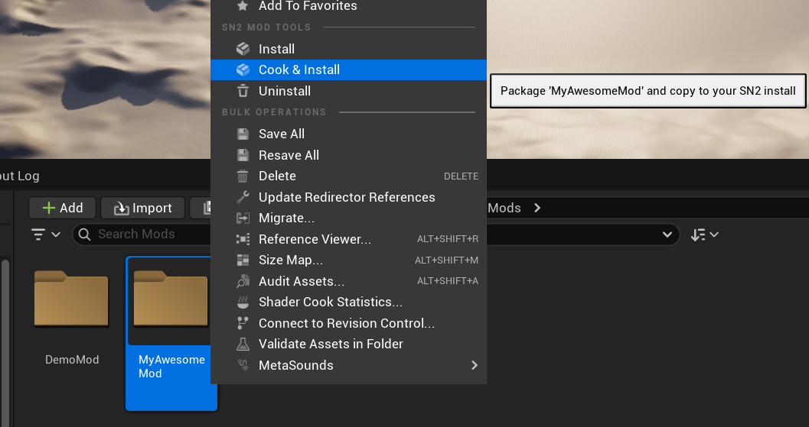

If you have multiple mods that you want to install after a single cook, you may also click on `Install` and that will install that mod's packaged files without having to recook again. And to uninstall the mod, just `Uninstall` button.

Finally, you can quickly launch SN2 by clicking the Mod Tools button and clicking `Launch Subnautica 2`. **Note:** it only works when the game is installed through steam.